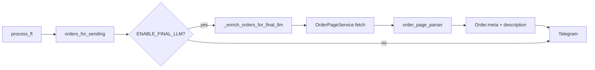

# Задача 1: парсинг страницы заказа на FL.ru

Итог интеграции в `workforge/` по [плану парсинга](https://cursor.com/plans/парсинг_страницы_заказа_5efb264c). Контекст pipeline — [ADR 0002](../../docs/adr/0002-ai-offer-pipeline.md).

**Суть:** после keyword-фильтра и (опционально) первой LLM, при `ENABLE_FINAL_LLM=1` сервис переходит на страницу заказа, забирает полное описание, определяет тип `project` / `vacancy`, скачивает вложения и пишет результат в `Order.meta` перед отправкой в Telegram.

**Статус:** enrichment реализован и проверен. Финальная LLM — [задача 2](task-02-final-llm-filtering.md).

**Коммит:** `773cce5b29ed3a4bb23a31292dd035aa1f1fde4e` — `Add FL.ru order page scraping with attachments download` (ветка `workforge`, 2026-09-01). Краткий hash: `773cce5`.

---

## Поток данных



---

## Изменённые файлы

### Новые

| Файл | Назначение |
|------|------------|
| [`src/fl/order_page_parser.py`](../src/fl/order_page_parser.py) | BS4: `detect_page_type`, `parse_order_page_html`, `DeadSessionError` |
| [`src/fl/order_page_service.py`](../src/fl/order_page_service.py) | httpx fetch, скачивание вложений, `enrich_order(s)` |
| [`src/common/fl_http.py`](../src/common/fl_http.py) | `fl_get()` с `trust_env=False` (без системного proxy) |
| [`scripts/smoke_order_page.py`](../scripts/smoke_order_page.py) | ручной smoke по URL вне `process_fl` |
| [`tests/unit/test_order_page_parser.py`](../tests/unit/test_order_page_parser.py) | 8 тестов |
| [`tests/unit/test_order_page_service.py`](../tests/unit/test_order_page_service.py) | 4 теста |
| [`tests/unit/test_cookies.py`](../tests/unit/test_cookies.py) | 2 теста merge cookies |

### Изменённые

| Файл | Изменение |
|------|-----------|
| [`src/use_cases.py`](../src/use_cases.py) | `_enrich_orders_for_final_llm()` перед Telegram |
| [`src/container.py`](../src/container.py) | `get_order_page_service()` |
| [`src/fl/main.py`](../src/fl/main.py) | `base_url = "https://www.fl.ru"` |
| [`src/common/cookies.py`](../src/common/cookies.py) | `merge_cookies()` вместо перезаписи `cookies.json` |
| [`src/common/scrap.py`](../src/common/scrap.py) | переход на `fl_get` |
| [`src/config.py`](../src/config.py) | `ORDER_ATTACHMENTS_DIR` |
| [`.env.example`](../.env.example) | комментарии к флагам final LLM |

---

## Поведение enrichment

- Срабатывает только при `ENABLE_FINAL_LLM=1`.
- Обрабатывает не более `FINAL_LLM_MAX_ORDERS` заказов из `orders_for_sending` (после keyword/LLM-фильтра).
- Обновляет:
  - `Order.description` — полный HTML описания со страницы;
  - `Order.meta.page_type` — `project` или `vacancy`;
  - `Order.meta.files` — список `{url, name, path}`;
  - `Order.meta.order_page_scraped` — `true` при успехе.
- Вложения сохраняются в `ORDER_ATTACHMENTS_DIR/{order_id}/` (по умолчанию `staticfiles/fl/attachments/`).

---

## Исправления по ходу тестирования

| Проблема | Решение |
|----------|---------|
| `load_cookies` перезаписывал `cookies.json` только новыми `Set-Cookie` → терялся `PHPSESSID` | `merge_cookies(stored, updated)` |
| `https://fl.ru` редиректил без cookies → `current-uid=0` (guest) | `base_url = "https://www.fl.ru"` в `fl/main.py` |
| Системный proxy ломал SSL к FL.ru | `fl_get()` с `trust_env=False` |
| Нет каталога `staticfiles/logs/` при первом запуске | `run.bat` создаёт его автоматически |

---

## Конфигурация

Скопировать [`.env.example`](../.env.example) в `src/.env` и заполнить секреты.

| Переменная | Назначение | Для проверки задачи 1 |
|------------|------------|------------------------|
| `ENABLE_FINAL_LLM` | включает scrape страницы | `1` |
| `FINAL_LLM_MAX_ORDERS` | лимит обогащения за прогон | `1` |
| `ORDER_ATTACHMENTS_DIR` | путь вложений | default OK |
| `ENABLE_CLASSIFICATION` | первая LLM | `0` (экономия) |
| `DEBUG` | один прогон без polling | `1` |
| Cookies | `staticfiles/fl/cookies.json` | dict с `PHPSESSID`, `XSRF-TOKEN` |

Пример cookies (формат dict, не list):

```json
{
  "PHPSESSID": "...",
  "XSRF-TOKEN": "..."
}
```

---

## Запуск и тестирование

Все команды — из каталога `workforge/`.

### Unit-тесты (14 шт.)

В venv нет pytest; тесты — plain-функции, запуск через Python:

```bash
cd workforge
PYTHONPATH=. venv/Scripts/python.exe -c "
import tests.unit.test_cookies as c
import tests.unit.test_order_page_parser as p
import tests.unit.test_order_page_service as s
for mod in (c, p, s):
    for name in dir(mod):
        if name.startswith('test_'): getattr(mod, name)()
print('14 tests OK')
"
```

Опционально: `venv/Scripts/pip install pytest`, затем:

```bash
PYTHONPATH=. venv/Scripts/python.exe -m pytest tests/unit/test_order_page_parser.py tests/unit/test_order_page_service.py tests/unit/test_cookies.py -q
```

**Покрытие:** parser (project/vacancy/guest), service (mock httpx, dead session, HTTP error), merge cookies.

### Smoke по URL (живой FL.ru)

```bash
cd workforge
PYTHONPATH=. venv/Scripts/python.exe scripts/smoke_order_page.py --target "https://www.fl.ru/projects/<id>/slug.html"
```

**Ожидание:** `page_type: project|vacancy`, `order_page_scraped` в meta, файлы в `staticfiles/fl/attachments/smoke/`.

**Проверено:** vacancy, 6 файлов скачано.

### Полный прогон `process_fl`

```bash
cd workforge
run.bat
```

Или вручную:

```bash
mkdir -p staticfiles/logs
PYTHONPATH=. venv/Scripts/python.exe src/main.py
```

**Ожидание в логах** (`staticfiles/logs/logs.log`):

```
GET https://www.fl.ru/projects/<id>/... "HTTP/1.1 200 OK"
```

Без `Dead session` / `current-uid=0`.

**Проверено:** enrichment одного заказа при `ENABLE_FINAL_LLM=1`, `FINAL_LLM_MAX_ORDERS=1`; сообщения в Telegram доходят.

---

## Ограничения / не в scope

- **Задача 2:** реализована — см. [task-02-final-llm-filtering.md](task-02-final-llm-filtering.md).
- **Пагинация:** `page-2`, `page-3` → 404; ~30 заказов за прогон.
- **`SEND_SKIPPED_ORDERS=1`:** много пропущенных keyword-заказов в Telegram.

---

## Следующий шаг

Задача 3: сборка финального текста отклика (greeting + LLM + signature).
