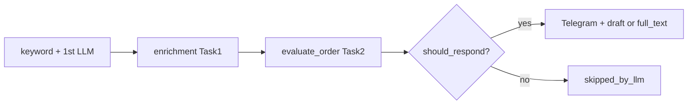

# Задача 2: финальная LLM-фильтрация

Интеграция в `workforge/` по ТЗ ([ADR 0002 §7.1](../../docs/adr/0002-ai-offer-pipeline.md)). Предшествует [задача 1](task-01-order-page-parsing.md) (enrichment страницы заказа).

**Суть:** после enrichment вызывается `evaluate_order` из `final_response/` — решение `should_respond`, черновик отклика, срок, цена, причина отказа. Отказы обрабатываются как у первой LLM.

**Статус:** подключено к `process_fl`. Сборка отклика — [задача 3](task-03-final-response-assembly.md). Задача 4 (auto-offer) **ещё не реализована**.

---

## Поток данных



---

## Изменённые файлы

| Файл | Изменение |
|------|-----------|
| [`src/use_cases.py`](../src/use_cases.py) | `order_to_final_response_input`, `_apply_final_llm_filtering`, вызов в `_process_fl` |
| [`src/common/dto_msg_converters.py`](../src/common/dto_msg_converters.py) | блок «Финальная LLM» в Telegram, скрытие enrichment meta |
| [`prompts/response_prompt.txt`](../prompts/response_prompt.txt) | учёт HTML description и `meta.files` |
| [`src/config.py`](../src/config.py) | комментарий к `FINAL_LLM_MAX_TOKENS` |
| [`.env.example`](../.env.example) | уточнены комментарии к `ENABLE_FINAL_LLM` |
| [`tests/unit/test_final_llm_use_cases.py`](../tests/unit/test_final_llm_use_cases.py) | 6 тестов pipeline-хука |
| [`tests/unit/test_convert_final_response.py`](../tests/unit/test_convert_final_response.py) | 2 теста Telegram-формата |

**Не менялось:** `final_response/service.py`, Claude-провайдер (отложен).

---

## Поведение

- **Gate:** `ENABLE_FINAL_LLM=1` (тот же флаг, что enrichment).
- **Scope:** первые `FINAL_LLM_MAX_ORDERS` из `orders_for_sending`.
- **Провайдер:** `FINAL_RESPONSE_PROVIDER` (`mock` / `yandex`) из `FinalResponseEnvs`.
- **Meta:** `order.meta.final_response` — dump `FinalResponseResult`.
- **Approve:** заказ остаётся в отправке; в Telegram — черновик или полный отклик (см. [задача 3](task-03-final-response-assembly.md)), срок, цена.
- **Reject:** убирается из основной отправки → `skipped_by_llm`; при `SEND_LLM_SKIPPED_ORDERS=1` — отдельное сообщение с причиной.
- **Ошибка API:** fail-open — заказ отправляется без `final_response` meta.
- **За пределами cap:** без финальной LLM (как раньше).

---

## Конфигурация

| Переменная | Назначение | Для проверки |
|------------|------------|--------------|
| `ENABLE_FINAL_LLM` | scrape + final LLM | `1` |
| `FINAL_LLM_MAX_ORDERS` | лимит за прогон | `1` |
| `FINAL_RESPONSE_PROVIDER` | провайдер | `mock` |
| `FINAL_RESPONSE_MAX_TOKENS` | лимит токенов LLM | `512` |
| `ENABLE_CLASSIFICATION` | первая LLM | `0` (экономия) |
| `SEND_LLM_SKIPPED_ORDERS` | отказы final LLM в Telegram | `1` |

`FINAL_LLM_MAX_TOKENS` в `Envs` **не используется** — см. `FINAL_RESPONSE_MAX_TOKENS`.

---

## Запуск и тестирование

### Unit-тесты

```bash
cd workforge
PYTHONPATH=. venv/Scripts/python.exe -c "
import tests.unit.test_final_llm_use_cases as u
import tests.unit.test_convert_final_response as c
for mod in (u, c):
    for name in dir(mod):
        if name.startswith('test_'): getattr(mod, name)()
print('8 tests OK')
"
```

### Smoke (полный pipeline, mock)

```bash
cd workforge
# src/.env: ENABLE_FINAL_LLM=1, FINAL_RESPONSE_PROVIDER=mock, DEBUG=1
run.bat
```

**Ожидание:** один заказ с блоком «✅ Финальная LLM - Одобрить»; отказы (description с «отказ») — в skipped-сообщениях.

### Smoke (изолированный модуль)

```bash
PYTHONPATH=. venv/Scripts/python.exe scripts/smoke_final_response.py
```

---

## Ограничения / не в scope

- Claude-провайдер
- Задача 4: отправка отклика на FL.ru

---

## Следующий шаг

[Задача 3](task-03-final-response-assembly.md) — сборка финального текста (реализована). Далее — задача 4 (auto-offer).
