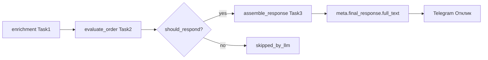

# Задача 3: сборка финального отклика

Интеграция в `workforge/` по ТЗ ([ADR 0002 §7.1](../../docs/adr/0002-ai-offer-pipeline.md)). Следует за [задачей 2](task-02-final-llm-filtering.md) (финальная LLM).

**Суть:** при `should_respond=True` собирается `full_text` = приветствие (MSK) + черновик LLM + подпись из файла. Текст сохраняется в `meta.final_response.full_text` и показывается в Telegram.

**Статус:** подключено к `_apply_final_llm_filtering`. Режимы Manual/Auto — [задача 4](task-04-work-modes.md).

---

## Поток данных



**Формат `full_text`:**

```
{greeting MSK}

{response_text}

{signature}
```

Пустые части не дублируются; между блоками — одна пустая строка.

---

## Границы приветствия (MSK)

| Часы MSK    | Текст          |
| ----------- | -------------- |
| 05:00–11:59 | Доброе утро!   |
| 12:00–17:59 | Добрый день!   |
| 18:00–04:59 | Добрый вечер!  |

Реализация: `zoneinfo.ZoneInfo("Europe/Moscow")` с fallback UTC+3 на Windows без `tzdata`.

---

## Изменённые файлы

### Новые

| Файл | Назначение |
|------|------------|
| [`src/final_response/greeting.py`](../src/final_response/greeting.py) | `get_time_greeting(now, tz="Europe/Moscow")` |
| [`src/final_response/signature.py`](../src/final_response/signature.py) | `load_signature(path)` |
| [`src/final_response/assemble.py`](../src/final_response/assemble.py) | `assemble_response(llm_text, ...)` |
| [`prompts/response_signature.txt`](../prompts/response_signature.txt) | placeholder-подпись (замените контакты) |
| [`tests/unit/test_assemble_response.py`](../tests/unit/test_assemble_response.py) | 7 тестов MSK + склейка |

### Изменённые

| Файл | Изменение |
|------|-----------|
| [`src/final_response/config.py`](../src/final_response/config.py) | `RESPONSE_SIGNATURE_FILE` |
| [`src/final_response/schemas.py`](../src/final_response/schemas.py) | поле `full_text` в `FinalResponseResult` |
| [`src/use_cases.py`](../src/use_cases.py) | `assemble_response` при approve → `meta.full_text` |
| [`src/common/dto_msg_converters.py`](../src/common/dto_msg_converters.py) | блок «Отклик:» вместо «Черновик:» при наличии `full_text` |
| [`.env.example`](../.env.example) | комментарий `RESPONSE_SIGNATURE_FILE` |
| [`requirements-runtime.txt`](../requirements-runtime.txt) | `tzdata` |
| [`tests/unit/test_final_llm_use_cases.py`](../tests/unit/test_final_llm_use_cases.py) | проверка `full_text` в meta |
| [`tests/unit/test_convert_final_response.py`](../tests/unit/test_convert_final_response.py) | +1 тест Telegram с `full_text` |

**Не менялось:** `final_response/service.py`, провайдеры, `offer.py` на стенде.

---

## Поведение

- **Gate:** тот же `ENABLE_FINAL_LLM=1`, что enrichment и final LLM.
- **Approve:** после `evaluate_order` вызывается `assemble_response`; в meta добавляется `full_text`.
- **Reject:** `full_text` не создаётся.
- **Ошибка сборки** (нет файла подписи и т.п.): заказ остаётся approved, в meta есть `response_text`, Telegram показывает «Черновик:» (fallback).
- **Ошибка API LLM:** без изменений (fail-open, meta пуст).

---

## Конфигурация

| Переменная | Назначение | По умолчанию |
|------------|------------|--------------|
| `RESPONSE_SIGNATURE_FILE` | путь к файлу подписи | `prompts/response_signature.txt` |
| `ENABLE_FINAL_LLM` | включает цепочку Task1+2+3 | `0` |
| `FINAL_RESPONSE_PROVIDER` | провайдер LLM | `mock` |

Замените содержимое [`prompts/response_signature.txt`](../prompts/response_signature.txt) на свои контакты.

---

## Запуск и тестирование

### Unit-тесты

```bash
cd workforge
PYTHONPATH=. venv/Scripts/python.exe -c "
import tests.unit.test_assemble_response as a
import tests.unit.test_final_llm_use_cases as u
import tests.unit.test_convert_final_response as c
for mod in (a, u, c):
    for name in sorted(dir(mod)):
        if name.startswith('test_'): getattr(mod, name)()
print('all tests OK')
"
```

(При установленном `pytest`: `PYTHONPATH=. venv/Scripts/python.exe -m pytest tests/unit/test_assemble_response.py tests/unit/test_final_llm_use_cases.py tests/unit/test_convert_final_response.py -v`)

### Smoke (полный pipeline, mock)

```bash
cd workforge
# src/.env: ENABLE_FINAL_LLM=1, FINAL_RESPONSE_PROVIDER=mock, DEBUG=1
run.bat   # или ./run.sh
```

**Ожидание:** у approved-заказа блок «✅ Финальная LLM - Одобрить» с **«Отклик:»**, текст начинается с «Доброе утро!» / «Добрый день!» / «Добрый вечер!» (по MSK) и заканчивается подписью из файла.

---

## Ограничения / не в scope

- Задача 4: отправка отклика на FL.ru (auto-offer)
- Telegram 4096 символов — truncate HTML при необходимости (отдельная доработка)
- Claude-провайдер final LLM (отложен)

---

## Следующий шаг

[Задача 4](task-04-work-modes.md) — режимы Manual/Auto (реализована). Далее — §5 ошибки auto-send или §6 CRM.
