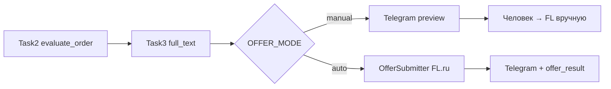

# Задача 4: режимы работы (Manual / Auto-send)

Интеграция в `workforge/` по ТЗ §4 ([ADR 0002 §7.1](../../docs/adr/0002-ai-offer-pipeline.md)). Следует за [задачей 3](task-03-final-response-assembly.md).

**Суть:** переключение между Manual review (default) и Auto-send. §5 (детальные ошибки → Telegram), §6 CRM, §7 промпты — **не в этой задаче**.

**Статус:** подключено к `_process_fl`. Стенд — [task-04 stand doc](../../docs/task-04-work-modes-stand.md) (локально).

---

## Поток данных



| Режим | Env | Поведение |
|-------|-----|-----------|
| **Manual review** (default) | `OFFER_MODE=manual` | Telegram с `full_text` + ссылка; без HTTP на FL |
| **Auto-send** | `OFFER_MODE=auto` | `OfferSubmitter` отправляет `full_text`; в Telegram — строка `offer_result` |

---

## Изменённые файлы

### Новые

| Файл | Назначение |
|------|------------|
| [`src/fl/offer_mode.py`](../src/fl/offer_mode.py) | `normalize_offer_mode`, `is_auto_offer`, `OfferResult` |
| [`src/fl/offer_submitter.py`](../src/fl/offer_submitter.py) | HTTP submit project/vacancy (порт `offer.py`) |
| [`tests/unit/test_offer_mode.py`](../tests/unit/test_offer_mode.py) | 2 теста режима |
| [`tests/unit/test_offer_mode_use_cases.py`](../tests/unit/test_offer_mode_use_cases.py) | 4 теста submitter + pipeline hook |

### Изменённые

| Файл | Изменение |
|------|-----------|
| [`src/config.py`](../src/config.py) | `OFFER_MODE`, `FL_RESUME_PATH` |
| [`src/use_cases.py`](../src/use_cases.py) | `_apply_auto_offers` после final LLM |
| [`src/common/fl_http.py`](../src/common/fl_http.py) | `fl_request` для POST |
| [`src/common/dto_msg_converters.py`](../src/common/dto_msg_converters.py) | `_format_offer_result_meta` |
| [`.env.example`](../.env.example) | комментарии `OFFER_MODE`, `FL_RESUME_PATH` |
| [`tests/unit/test_convert_final_response.py`](../tests/unit/test_convert_final_response.py) | +1 тест auto offer result |

---

## Поведение

- **Gate Manual:** `OFFER_MODE=manual` (default) — как до задачи 4 (Telegram preview).
- **Gate Auto:** `OFFER_MODE=auto` + approve + `full_text` → `OfferSubmitter.submit`.
- **Meta:** `order.meta.offer_result` — `{status: ok|already|no_balance|error, message?}`.
- **Telegram Auto:** после блока «Отклик» — строка «Auto-offer: …».
- **Ошибка submit:** лог warning + `offer_result.status=error`; заказ всё равно уходит в Telegram.
- **Vacancy + resume:** `FL_RESUME_PATH` для auto vacancy с обязательным резюме.

---

## Конфигурация

| Переменная | Назначение | Для проверки |
|------------|------------|--------------|
| `OFFER_MODE` | `manual` / `auto` | `manual` (default) |
| `ENABLE_FINAL_LLM` | цепочка Task1–3 | `1` |
| `FINAL_RESPONSE_PROVIDER` | LLM | `mock` |
| `FL_RESUME_PATH` | резюме для vacancy auto | путь к файлу или пусто |

Cookies FL.ru: `staticfiles/fl/cookies.json` (как Task1).

---

## Запуск и тестирование

### Unit-тесты

```bash
cd workforge
PYTHONPATH=. venv/Scripts/python.exe -c "
import tests.unit.test_offer_mode as om
import tests.unit.test_offer_mode_use_cases as ou
import tests.unit.test_convert_final_response as cf
import tests.unit.test_final_llm_use_cases as fu
for mod in (om, ou, cf, fu):
    for name in sorted(dir(mod)):
        if name.startswith('test_'): getattr(mod, name)()
print('all tests OK')
"
```

### Smoke Manual (default)

```bash
cd workforge
# src/.env: ENABLE_FINAL_LLM=1, FINAL_RESPONSE_PROVIDER=mock, OFFER_MODE=manual
run.bat
```

**Ожидание:** Telegram с блоком «Отклик», **без** строки Auto-offer.

### Smoke Auto

```bash
# src/.env: OFFER_MODE=auto, ENABLE_FINAL_LLM=1, FINAL_RESPONSE_PROVIDER=mock
# cookies.json актуален, на FL есть отклики
run.bat
```

**Ожидание:** строка «Auto-offer: отклик отправлен» или «нет откликов» / «уже откликались».

---

## Ограничения / не в scope

- §5: расширенная классификация ошибок FL → отдельная задача
- §6 CRM
- §7 версии промптов
- Telegram 4096 символов — truncate отдельно

---

## Следующий шаг

§5 (ошибки auto-send → Telegram) или §6 CRM — по приоритету.
